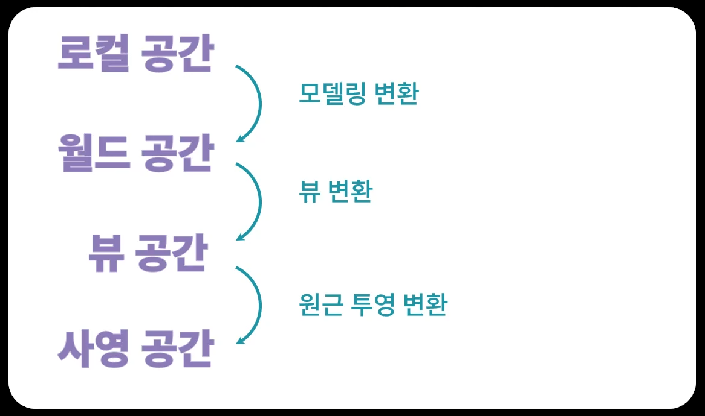

<h1> 게임에서 사용되는 수학 </h1>

1. 공간에 대한 수학
2. 물체에 대한 수학
3. 회전에 대한 수학

<h2> 공간에 대한 수학 </h2>
<h3> 게임 : 우리가 사는 현실 세계를 모방한 가상 세계 </h3>

게임 세계는 우리가 사는 현실 세계와는 완전히 다르다.   
우리가 사는 현실 세계는 불확실한 미지의 공간, 
컴퓨터로 만들어진 가상 세계는 수로 만들어진 명확한 시스템이다.    
-> 벡터 공간(vector space) : 게임이 사용하는 가상 공간의 본질

__물리학의 벡터와 스칼라__   
벡터 : 크기와 방향을 가진 대상   
스칼라 : 크기만 있는 물리량

__수학에서의 벡터와 스칼라__   
벡터 : 벡터 공간의 원소   
스칼라 : 체 집합의 원소

<h3> 변환(Transformation) </h3>

수학적 의미의 벡터와 스칼라의 개념을 잡는것으로 부터 모든 가상 공간의 시작이 된다.   
다차원 공간이 만들어지고, 색을 입혀 모니터 화면에 표시하면 현실세계와 그럴 듯한 가상세계가 만들어지는 것.   

가상 세계가 구축된 원리를 파악했다면, 우리가 원하는 모습으로 이 가상 세계를 변형해야한다.   
이를 수학에서는 변환(transformation)이라고 한다.   
1초에 60프레임을 찍어내는 게임의 특성상, 이러한 변환 과정은 빠르고 단순하고 명료하게 이루어져아 한다.   
이를 선형 변환(Linear Transformation : 선형성을 가진 변환)이라고 한다.   
이 선형 변환 과정을 통해서 빠르게 공간을 변형하고, 이 변환된 공간을 원래대로 돌리는 것도 가능하다.

<h3> 현실 세계의 공간은 하나. 게임의 가상 공간은 무한대. </h3>

현실 세계의 공간은 하나 뿐이나, 수가 만들어대는 공간은 수의 갯수만큼 무한하다.   

어떤 모델러가 모델링한 객체를, 게임의 스테이지에 올리고, 이것을 카메라가 바라보고, 바라본 화면을 모니터에 투영해 주는 과정에 많은 공간이 사용된다.   
보다 그럴듯한 모습을 화면에 보여주기 위해, 개발자들이 나름의 공간 변화 체제를 만들어 놓았는데,   
이를 렌더링 파이프라인이라고 한다. 일반적으로 다음 그림과같은 공간과 변환들이 사용된다.

<h3> 행렬 : 선형 변환을 수행하는 도구 </h3>

이러한 체계가 만들어졌으니, 컴퓨터에게 일을 시켜야 한다. 일을 지시하기 위한 도구가 수학의 행렬이다.   
행렬은 컴퓨터로 하여금 가상 공간을 빠르게 변화시키도록 지시하는 일종의 명령어라고 할 수 있다.   
렌더링 파이프라인에서 사용하는 공간을 변환할 때 사용하는 것들이 모두 행렬에 대응되며, 이미 렌더링 파이프라인에서 사용되는 행렬도 정해져 있다.   
하지만, 내가 원하는 공간 변환을 실제로 구현하기 위해서는, 주어진 행렬을 암기하는 것이 아니라,   
스스로 행렬을 설계할 수 있도록 기본 원리를 이해하는 것이 중요하다.   

<h3> 평면의 방정식 </h3>

행렬로 공간에 대한 변환이 어떻게 이루어지는지 메커니즘을 이해했다면, 그 다음에 알 것은 평면의 방정식이다.   

    ax + by + cz + d = 0   

평면의 방정식을 사용하면, 여러개의 평면을 사용해서 공간 안에 자신의 영역을 구축할 수 있다.   
구축된 영역 안에 어떤 작업을 할 지 수학을 사용해서 지정할 수 있다.   
ex : 카메라가 보는 영역(절두체, frustum)은 여섯개의 평면으로 구성되어 있다.   
여기에서 보이는 물체만 걸러내서 렌더링하는 수학적인 매커니즘.   

__중요한 것__   
1. __수의 체계와 벡터 공간__   
2. __선형 변환과 행렬__

