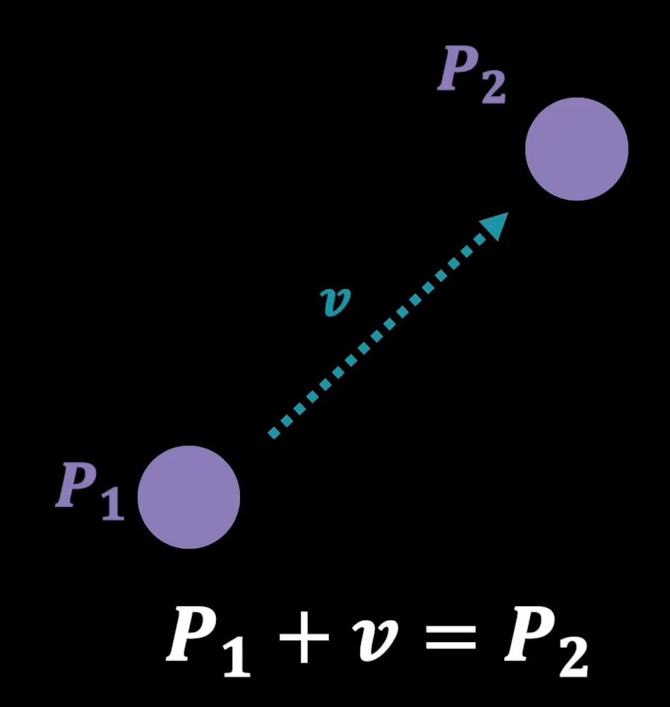

<h1>물체의 수학 1 : 이동 변환의 구현 원리 </h1> 

<h2> 물체에 대한 수학이란? </h2>

게임에서 사용하는 가상 공간의 체계와 물체를 구성하는데 사용하는 수학   
게임에서 사용하는 가상세계는, 다차원으로 구성된 수의 데이터인 벡터 공간으로 이루어져 있다.   
벡터 공간은 어떤 대상의 성질을 표현하는데 사용하는 데이터이다.   
벡터 공간의 공간과 현실 세계의 공간은 다른 개념이다.   
하지만 벡터 공간으로 현실 세계와 유사한 공간을 만들어내야 한다. 어떻게 할 수 있을까?   
-> 답은 __공간의 차원을 놀리는 것에 있다.__

예를 들어, 다음과 같이 평평한 사각형 연이 있다고 생각해보자.

2차원 벡터공간에 속하는 벡터를 사용해서 이 연을 표현하는데는 큰 문제가 없을 것이다.   
그리고, 추가된 공간에는 연을 움직일 수 있도록 실을 설치하고, 그 실을 연에 연결시켜준다.

2차원 공간이 연을 표현하는데 사용됐다면, 3차원 공간을 아예 크게 만들어서, 연과 거기에 딸린 실을 추가로 구성해준다.   
그리고 그 실을 조정해서 연을 움직이게 만든다.   
보는 사람이 멀리서 연만 바라보면 연이 움직인다고 생각하게 된다.

이렇게, 2차원 물체는 물체의 표현에 2차원, 이동을 구현하는 데는 1차원. 총 3차원의 공간을 활용하고,   
3차원 물체는 표현에 3차원, 이동을 구현하는 데는 1차원, 총 4차원의 공간을 활용한다.

이렇게 게임을 제작하는 바탕에는 벡터 공간이라는 것을 크게 만들어서, 이것을 둘로 쪼개고,   
물체를 구성하는 부분 공간(점)과, 이동을 구성하는 부분(이동 벡터) 공간 두가지로 나누어서 관리하는 시스템이 기반에 구축되어 있다.   

게임은 벡터 공간을
1. 물체를 표현하는 공간 = 아핀 공간
2. 이동을 위한 공간
으로 분리해 관리한다.

아핀 공간에 속한 요소들이 벡터이기는 하나, 이 요소들은 물체를 표현하는데 사용되며,    
이 요소를 구분짓기 위해 별도로 점이라고 이야기한다.   
따라서 가상 공간의 물체는 점으로 구성되어 있다고 할 수 있다.

이동에 사용하는 다른 부분공간에 속한 벡터를 벡터(Vector) 또는 이동 벡터라고 부른다.   
* 수학적 벡터 : 벡터 공간의 원소   
* 물리적 벡터 : 크기와 방향을 가진 대상   
이동 벡터는 물리적 벡터에 해당한다.

우리가 현실세계에서 어떤 물체에 힘을 가하면, 그 힘의 크기와 방향만큼 그 물체가 이동을 하게 된다.   
게임도 마찬가지로, 아핀 공간에 점을 사용해서 물체를 만들면,   
이 물체는 이동 벡터가 가지고 있는 크기와 방향을 사용해서 이 점을 이동시키도록 구현되어 있다.

이를 수식으로 나타내면 다음과 같다.

어떤 한 점 p1에 이동 벡터(v)를 더해주면, 그 힘에 따라 움직인 최종 점인 p2에 대응하게 된다.   
이를 다른말로 하면 두 점 사이에는 하나의 벡터가 대응된다고 할 수 있으며,   
점 p1을 우변으로 넘겨서 점과 점을 빼면 이동 벡터를 얻을 수 있게 된다.

앞선 식에서 v는 점 p1에서 출발해서 점 p2로 가는 이동벡터이다.   
그렇기 때문에 두 점을 뺐을 때 나오는 결과는 뒤에 위치한 점에서 앞에 위치한 점으로 향하는 벡터가 만들어지는 것이다.

점으로 구성된 아핀 공간과, 이동 벡터로 구성된 부분 공간은 서로 분리된 공간이다.   
하지만 두 점의 뺄셈을 통해 다른 공간의 데이터가 교환 될 수 있다.

<h2> 게임 공간에서 물체의 배치 </h2>

우리가 사는 현실 세계와, 게임의 가상 세계가 동작하는 방식이 완전히 다르기 때문에 주의해야 한다.   
현실 세계는 하나의 공간만 존재하고, 이 공간에 물체들이 들어와서 배치되어 존재하게 된다.   
하지만 가상 공간은 현실세계와 다르게 동작한다. 가상 세계에는 무한대의 가상 공간을 만들 수 있다.

지금 영상에서는 게임 제작을 위해 물체를 마우스로 드래그해서 배치하고 있다. 현실에서와 같이 물체를 배치하는 것 처럼 보이지만, 내부에서 동작하는 메커니즘은 완전히 다르다.
이 과정이 어떻게 진행되는지 설명하겠다.

먼저 앞서서 설명했지만, 게임에서 사용되는 공간은 3차원으로 보이지만 실제로는 4차원 공간이다.   
게임공간은 움직일 일이 없기 때문에 사실은 4차원 중에서 3차원만 사용이 되고, 나머지 차원에 대한 값은 기본값(0, 0, 0)으로 두게 된다.   
이러한 게임 공간을 월드 공간이라고 한다. 중심이 되는 공간이기 때문에 움직이지 않는 것이다.

그 다음에는 물체를 배치하는 과정에 대해 알아보자.   
물체는 아핀 공간에 **점들로** 구성되어 있다. 
이 점들을 관리하기 위해서는 이것들을 표괄하고 있는 공간이 필요하다.   
이 역시도 4차원 공간으로 구성되어 있다. 
이렇게 물체의 점을 담는 공간을 *로컬 공간* 이라고 한다.   

게임의 무대인 월드 공간과 다르게 물체는 계속해서 움직여야 하기 때문에, 
나머지 한 차원의 공간은 적극적으로 사용을 해야 한다.   
그렇기 때문에 물체를 드래그해서 물체를 월드 공간으로 배치하는 과정이 
마치 눈으로 봤을 때는 물체를 구성하는데 사용되는 점을 월드 공간으로 이동시키는 것으로 보여질 수 있다.   
하지만 실제로는, 월드 공간이 있고, 물체를 담는 로컬 공간을 그 위에 덮어서 포갠다고 생각하면 된다.   

즉, 물체를 구성하는 점은, **자기가 속한 공간을 단 한번도 바꾼 적이 없다.**   
로컬 공간은 언제나 항상 물체와 따라다닌다고 생각하면 된다.   
로컬 공간의 물체를 표현하고 남은 한 차원 공간을 조정해서 로컬 공간을 이동시키는 것이다.   
그러면 마치 월드 공간에서 물체가 이동되는 것 처럼 보이는 것이다.   
이렇게 구현해도, 사실 공간이라는 것은 눈에 보이지 않기 때문에 게임을 플레이하는 입장에서는 알 수 없고,
4차원 공간자체가 인지하기가 불가능한 영역이기 때문에, 나머지 공간에 대한 존재를 느낄 수 없다.

<h2> 정리 </h2>

벡터 공간은 대상의 성질을 표현하는데 사용하지만, 게임 제작을 위해 끈달린 물체의 개념으로
한 차원 높여서 대상과 이동을 함께 구현하는 기법을 사용한다.   
그렇기 때문에 게임을 구성하는 모든 물체는 4차원의 공간을 가지게 된다.   
이렇게 확장된 공간의 개념에서 벡터는 용도에 따랑 물체를 구성하는데 사용하는 점,
물체를 이동하는데 사용하는 이동 벡터로 나누어진다.   
여기서 우리가 배우는 수학도 점을 다루는 수학과, 이동벡터를 다루는 수학으로 세분화된다.