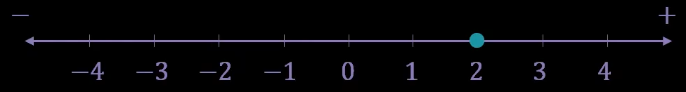
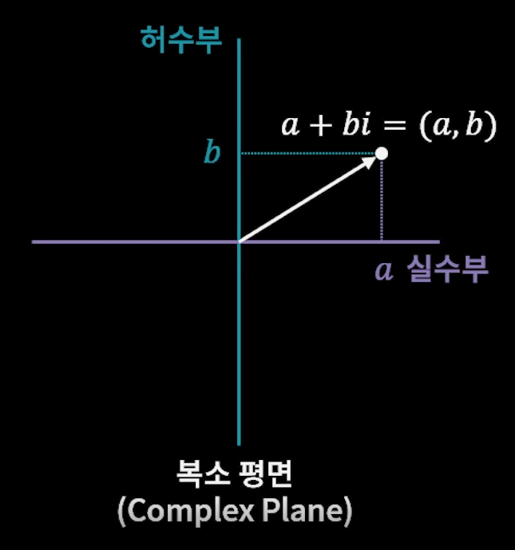
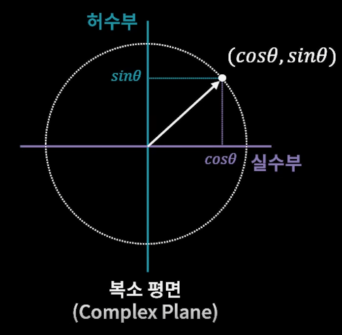
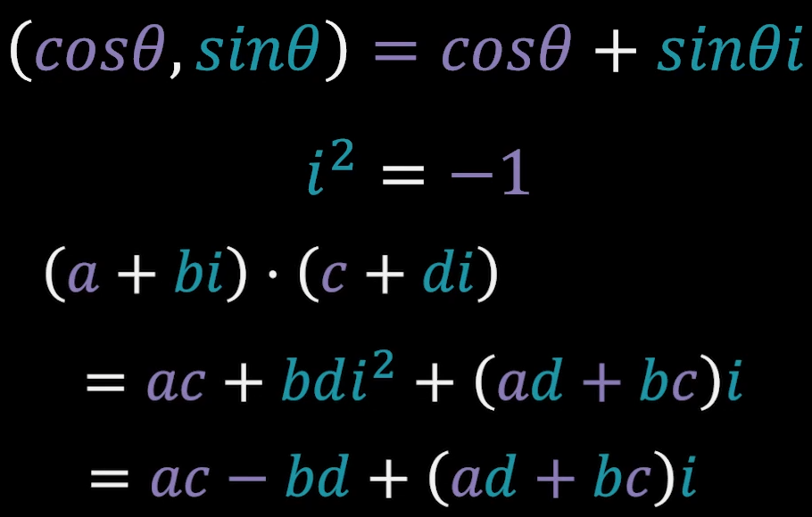
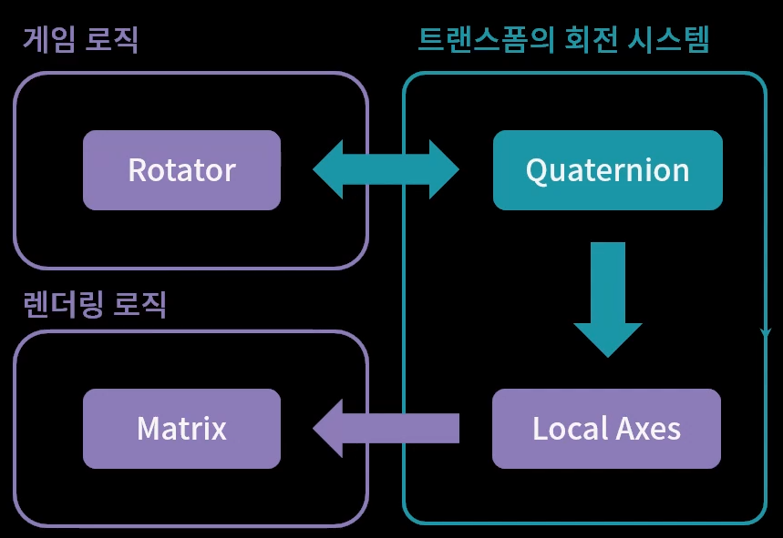

<h1> 회전의 수학 2 : 사원수 </h1>

앞서, 3차원 회전을 표현할 때 축-각 회전과 오일러 각 회전이 있으며  각 방식에는 장단점이 있다고 하였다.
이 두 가지의 중간 포지션에서 문제점을 해결해 줄 수 있는 솔루션이 잇는데, 이것이 사원수이다.

<h2> 사원수(四元數) </h2>

사원수는 우리가 일상생활에서 사용하는 실수와 같은 수이다.
실수는 하나로 구성되어 있는데, 사원수는 네 개의 요소로 구성되어 있다.

    실수 : a
    사원수 : a + bi + cj + dk

수란 무엇인가?
수학에서 수는 집합의 개념에서 수를 관리하고 있다.
실수 집합을 시각화 할 때, 아래와 같은 수직선을 사용한다. 하나의 수를 수직선 위의 점에 대응하고,
그 점이 빈틈없이 채워져 있으면, 이는 개념적으로 무한의 요소를 가지는 실수가 된다.

그런데, 이렇게 단순한 집합 개념에서 수를 바라보는 데에는 한계가 있다.
왜냐하면 집합이란 단순히 원소의 묶음을 의미한다.
수에는 연산이 존재하기 때문에 단순 집합과 차별점을 가진다.
수가 다른 집합과 가지는 차별점은 사칙 연산에 있다.
사칙 연산이란 수와 수를 사용해서 두개를 결합해 새로운 수를 만들어내는 시스템을 말한다.
이러한 시스템을 구조를 가진 집합이라고 표현한다.
수가 가지고있는 이런 연산 체계를 분석하여, 수학자들은 다음과 같은 성질들을 도출했다.

연산에 대한 공리(Axion)
1. 교환 법칙
2. 결합 법칙
3. 분배 법칙
4. 항등원
5. 역원

이러한 성질들을 만족할 수 있는 체계, 이것이 만족된다면 몇 개로 구성이 되어있던간에 수라고 부를 수 있는 것이다.
여러 요소로 구성되어 있는 수 중에서, 대표적인 것이 복소수이다.
복소수는 우리가 사용하는 실수와, 허수로 구성된 일상생활에서는 사용하지 못하는 특이한 수이다.
하지만, 앞서 설명한 연산체계가 빈틈없이 작용하기 때문에 우리가 수라고 부를 수 있는 것이다.

이 복소수에서 개념이 확장된 수가 네 개로 구성된 사원수이다.
사원수는 실수와 세 개의 허수로 구성되어 있는데, 이 역시도 연산 체계가 잘 동작하고 있기 때문에 수라고 부르는 것이다.

이러한 수의 체계를 자세하게 설명할 수 없지만, 간단하게 한마디로 요약하자면,
<모든 회전이란 크기가 1인 수와의 곱이다>라고 요약할 수 있다.

예를 들어, 실수의 곱셈 연산을 살펴보자.
어떤 수 a에, 1을 곱하면 언제나 동일한 수를 만들어낸다.
이는 회전의 관점에서 보면, 0도 회전했다(회전 하였으나, 아무런 회전이 들어가지 않았다.)라고 볼 수 있다.

실수에서 크기가 1인 다른 수로는 -1이 있다. 어떤 수에 -1을 곱하면 부호가 바뀐다. 이는 180도 회전했다고 불 수 있는 것이다.
실수에는 이 두 가지 외에는, 크기가 1인 수가 존재하지 않는다.
사실 실수는 평면이 아닌 직선이기 때문에, 우리가 회전을 논하는게 큰 의미가 없다.

하지만, 어떤 평면을 나타내는 수가 있다면 어떻게 될까?
앞서 얘기한 복소수는 실수와 허수로 구성되어 있으며, 평면으로 표현이 가능하다. 
이를 복소평면이라고 이야기 한다.
복소평면은 실수를 x축, 허수를 y축으로 두고 다음과 같이 좌표로 표현한다.

그렇다면 여기서 크기가 1인 수는 어떤 것들이 있을까? 앞선 삼각함수를 이용하면 (cos(Θ), sin(Θ))의 조합으로
크기가 1인 복소수를 표현할 수 있다.
복소수 체계가 가진 곱셈 연산을 사용해서, 임의의 복소수에 크기가 1인 복소수를 서로 곱하면,
주어진 각 Θ만큼의 회전이 발생한다는 것이다.

이러한 복소수 체계와 유사하게, 3차원 공간의 회전을 나타내는 수 체계도 있을 것이다.
아일랜드의 해밀턴이라는 수학자가 연구하였으나, 이를 만족하는 수 체계를 찾을 수 없었다.
어느날 다리를 건너다가 4차원의 관점에서 체계를 생각해보자는 영감이 떠올랐다고 한다.

해밀턴이 발견한 4차원의 체계가 바로 사원수이다.

사원수는 앞서서 설명한 것 처럼, 하나의 실수와 세계의 허수로 구성된다.
이를 3차원 공간에서 응용할 때에는, 3차원의 축을 각 허수 i, j, k에 대응시키고,
나머지 한 차원을 0으로 두어서 다운다.

해밀턴이 처음 이 4원수를 다룰 때, 세개의 허수를 묶어서 벡터라고 다뤘고, 실수를 스칼라라고 불렀다.
지금은 이 용어의 정의가 변화되었다.

이러한 사원수의 곱셈 연산은 벡터와 실수의 계산으로 나눠서 계산해보면 벡터의 내적과 외적으로 요약이 된다.
사원수도 복소수와 마찬가지로, 크기가 1인 사원수와의 곱은 4차원 공간에서의 회전을 의미한다.

__사원수의 활용__   
사원수는 외적 연산을 사용해서 빠르고 편리하게 회전을 처리할 수 있는 계산 방법이다.
하지만 축-각방식이고, 절반의 각으로 파생되기 때문에 일반인들이 직관적으로 사용하기는 어렵다.
그래서, 게임 제작 단계에서는 오일러 각 방식은 여전히 유용한다.
하지만, 4원수가 제공하는 축각방식은 부드러운 회전이나 짐벌락 문제를 예방할 수 있기 때문에,
내부적으로 회전을 계산할 때에는 유용하게 사용할 수 있으며, 행렬로 변환이 용이하다.

이것들을 정리하면, 보이는 그림과 같이 게임 엔진들이 회전 시스템을 구축한다고 요약할 수 있다.
먼저 회전에 관련된 모든 계산은 내부적으로 사원수체계에서 진행된다.
하지만 컨텐츠 개발자들이 게임 컨텐츠를 만들 떄에는, 지정된 각을 다루기 편하도록,
유저 인터페이스에서는 오일러 방식으로 변환해서 보여준다.
