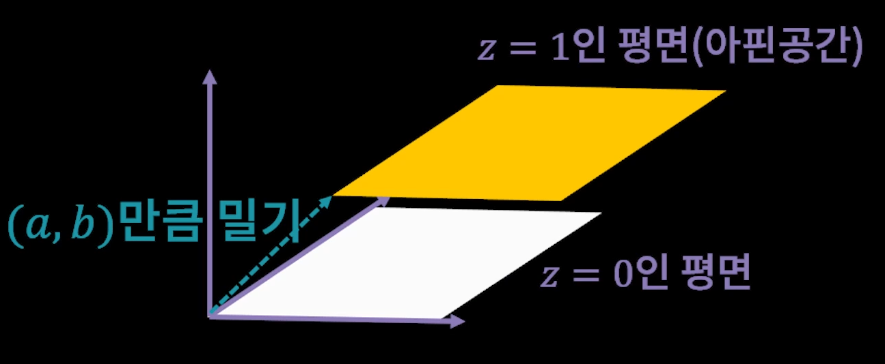
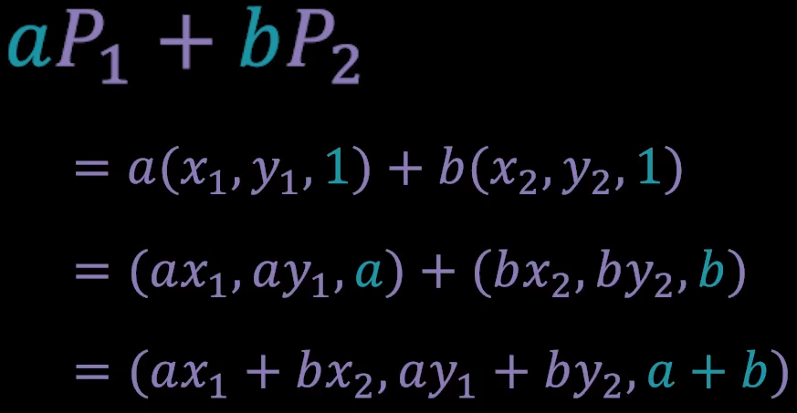
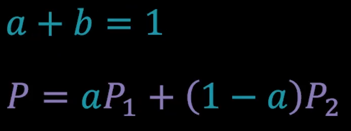
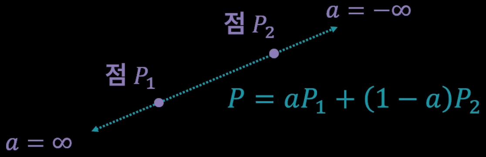
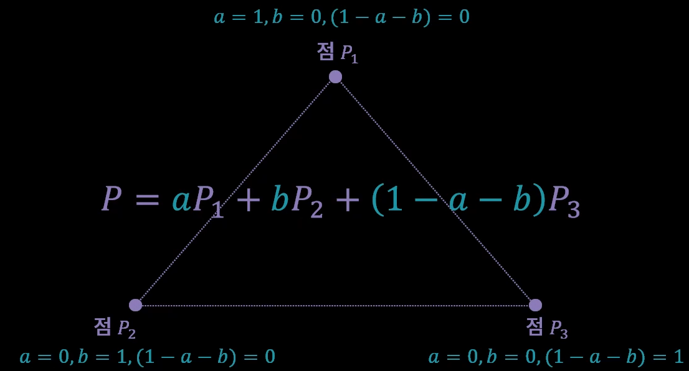

<h1> 물체의 수학 2 : 삼각형과 정점 </h1>

앞서, 게임의 벡터 공간은
1. 물체를 표현하는 아핀 공간
2. 이동을 위한 공간
으로 나뉘어진다고 배웠다. 

그렇다면 3차원 공간으로 2차원 물체의의 2차원 이동을 예시로 들어보자.

먼저, 그림처럼 2차원 물체를 표현하기 위한 공간이 노란색 영역으로 표시가 되어있다.   
이 영역이 가지는 값은, 마지막 차원의 값이 항상 1이 된다.   
이 노란 공간을 아핀 공간으로 부른다.   
그렇다면 아핀 공간은 왜 마지막 차원의 값이 1이 되어야 하는 것일까?   
그것은, 3차원 공간의 물체를 밀었을 때, 그 민만큼 정확하게 이동한 평면의 마지막 차원의 값이 1이 되기 떄문이다.   
다른 값을 가지는 평면의 경우에는 우리가 민 만큼 이동하는 효과를 가져오지 않는다.   
그렇기 떄문에 마지막 공간의 값이 1인 공간을 사용하는 것이다.   
그렇다면 여기서 미는 양에 대한 것을 표현하는 공간도 별도로 있어야 할 것이다.   
그 부분은 마지막 차원이 0인 공간이다.   
이렇게 높이를 나타내는 마지막 차원의 값이 0과 1로 고정되어 있기 떄문에, 점에 어떤 벡터를 밀더라도, 그 점이 위로 가거나 하지 않고 평행하게 옆으로 움직인다.   
1 + 0 = 1   
점 + 벡터 = 점

그렇다면 점에 점을 더하면 어떻게 될까? 이것은 1 + 1 = 2가 되기 때문에, 점의 영역인 아핀 공간에서 벗어나게 된다.   
따라서 점 + 점은 할 수가 없다.

하지만, 점과 점을 더할때, 각 점의 앞에 계수를 곱해서 더해보자.   
두 계수를 a와 b라고 했을 때, 마지막 차원의 값만 보면 a+b가 된다.   
만약 a+b가 1이라고 하면, 그 두 점을 더했을 때는 항상 점이 된다는 결론이 나온다.

그렇다면, 이 조건을 상시화시켜 b를 1 - a로 바꿔 두 점을  더해보자

그러면 a의 값과 무관하게 마지막 차원의 값은 1이 된다.   
이 공식은 점과 점을 더했을 때, 언제나 아핀 공간의 점을 보장한다.   
그래서 두 점을 조합하여 새로운 점을 만들어내는 공식이 된다.   
이러한 공식을 수학에서는 아핀 조합(affine combination)이 된다.

<h2> 아핀 조합(affine combination) </h2>
이 아핀 조합은 물체를 구성하는데 기본이 되고 중요한 역할을 하게 된다.

먼저, 두 점의 조합이 어떤 결과를 가져오는지 살펴보자.   
두 점을 조합했을 때, 이 조합으로 만들어진 새로운 점은 계수 a의 범위에 따라 변화시킬 때 두 점을 잇은 무한대의 선상에 위치하게 된다.   
두 점을 조합해서 만들어지는 선을 직선(Line)이라고 얘기한다.

여기에서, 계수 a의 값이 0이면, 생성되는 점은 점 p2를 가리키게 되고,   
정수 a의 값이 1이 되면 점 p2를 가리키게 된다.   
0보다 큰 모든 실수를 사용한다고 가정했을 때에는, 점 p2에서 점 p1으로 향하게 되는 무한대의 직선이 만들어지게 되는데, 한 쪽은 고정되어 있다.   
이러한 선은 반직선(Ray)라고 얘기하며, 게임 제적에서 많이 사용되는 개념이다.

    레이캐스팅(Raycasting) : 
        시선 방향에 장애물이나 목표물이 있는지 감지하는 기능
    레이트레이싱(Raytracing) : 
        최종 목적지인 모니터 화면에서 거꾸로 빛의 방향을 추적해 렌더링하는 기법

지정한 두 점 p1과 p2를 생성하기 위해서는 각 계수과 1과 0이 되어야 한다.   
그렇기 때문에 우리가 사용하는 수의 범위를 0에서 1 까지로 좁히게 되면, p2에서 p1으로 잘라지는 선이 만들어진다.   
시작과 끝이 분명한 선을 선(Line Segment)라고 한다.

두 점을 조합해 선을 만들어내는 수학을 알아봤으니, 한 차원 높여서 면을 생성하는 수학을 알아보자.

면의 수학은, 점을 세 개 조합하는 메커니즘으로 구성된다. 점 세개에 계수를 붙인 후, 마찬가지로 끝의 값이 항상 1이 되도록 (1 - a - b)를 붙여주게 되면, 마지막 차원의 값은 1이 보장된다.
이 세 점을 조합한 결과는 평면을 만들어내게 된다.

여기서 점에 사용되는 세 계수의 값의 번위를 0에서 1까지로 제한하게 되면, 이 세 점이 가지고있는 영역의 내부에 위치한 점을 생성하게 되는데, 
이것이 바로 삼각형의 영역이 된다.
이 삼각형이 모여서 물체를 생성하게 되고, 이것들을 각각 하나씩 그려추는 것이 결국 게임 그래픽의 기본 원리라고 할 수 있다.
이런 삼각형의 정보를 모아둔 것이 메쉬(Mesh)라고 이야기한다.

그렇다면 왜 점으로 물체를 그리지 않고 삼각형으로 물체를 그릴까?

만약 점 100개로 이루어진 물체를 내가 가까이에서 보고싶다고 했을 때에는, 점 100개에 대한 부분이 멀리 퍼지게 되면서 물체에 대한 밀도가 굉장히 떨어지게 된다.
하지만 삼각형으로 물체가 가지고 있는 영역을 일단 설정한 다음에, 삼각형 내부에 소속되어 있는 픽셀의 갯수를 구하고, 이것을 각각 칠하게 되면
정밀하게 보여줄 수 있는 체계를 만들어 낼 수가 있게 된다.

이렇게 삼각형이 가지고 있는 영역을 픽셀로 변환하는 과정을 픽셀화(Rasterization)이라고 이야기한다.

삼각형에 대한 수학은 세 개의 점과, 각각의 점에 대응되는 점의 계수들로 구성되어 있다.
각 계수들의 범위는 1을 넘어설 수가 없고, 0보다 떨어질 수 없기 때문에 어떤 점이 1이 된다면, 나머지 점들은 반드시 0이 되어야 한다.
그렇기 때문에 이 세 개의 점의 값을 가지고 방정식을 사용해 만들어진 새로운 점이 삼각형을 구성하는 세 점 중에
어디에 가까운지 그 비중을 파악할 수 있다.

만약 모든 계수의 값이 1/3씩 균등하게 퍼져있다면, 이 방정식으로 만들어진 새로운 점은 삼각형의 정 중앙에 위치하게 되는 것이다.
이 계수들을 모아서 좌표를 만들수 있는데, 이를 무게중심좌표(Barycentric Coordinate)라고 한다.

삼각형 내부의 픽셀을 칠할 때, 이 픽셀이 가지는 무게중심좌표를 알고있다면, 
이 픽셀의 색상을 결정할 때 각 점에 있는 데이터를 적절히 혼합해서
원하는 데이터를 만들어낼 수 있다.

이는 색상 뿐 아니라 좌표에서 사용할 수 있다. 삼각형에 텍스처를 오려붙일 때에도 이를 사용하게 된다.
이때 사용하는 좌표를 UV좌표라고 한다. 
텍스쳐 영역을 각 삼각형의 면에 대응해서 표현한다.
각 점에 대응하는 이미지의 2차원 좌표를 넣어서 정점에 지정한 좌표의 끄트머리를 붙여주면
삼각형 내부 영역은 자동으로 무게중심 좌표를 사용해 내부를 채워주게 된다.

삼각형을 구성하는 점에 색상, uv, 노멀, 탄젠트 등 부가적인 데이터를 넣은 최종적인 점의 데이터의 묶음을 정점(Vertex)라고 한다.

<h2> 젇리 </h2>
게임에서 하나의 물체를 게임에 그리는 과정은 물체를 세 개의 vertex로 구성된 삼각형으로 분리하고,
이것을 각각 그려서 화면을 채우는 것으로 요약할 수 있다.
이 과정은 정형화되어 있기 때문에, 보통 렌더링 파이프라인이라고 하며 그래픽카드가 자동으로 처리해주고 있다.
하지만 응용력을 높이기 위해 중간에 개발자가 원하는 기능을 끼워넣을 수 있도록 두가지 함수를 제공하는데,
그것이 바로 정점 셰이더(Vectex Shader)와 픽셀 셰이더(Pixel Shader)이다.

정점 셰이더(Vertex Shader)는 삼각형을 구성하는 각 정점의 최종 데이터를 확정해주는 기능을 가지고 있다.
정점 셰이더에서 약간의 수학을 도입하면, 시간에 따라서 흔들리는 물체를 표현하는 것이 가능하다.

픽셀 셰이더(Pixel Shader)는 삼각형 내부를 구성하는 각 픽셀의 최종 색상을 확정하는 기능을 가지고 있다.
각 픽셀들은 앞서 설명한 무게중심좌표에 의해 계싼된 값이 자동으로 들어오게 되고,
이 값과 텍스쳐의 값, 조명 등의 값이 결합되며 다양한 효과를 주는데 사용하게 된다.
