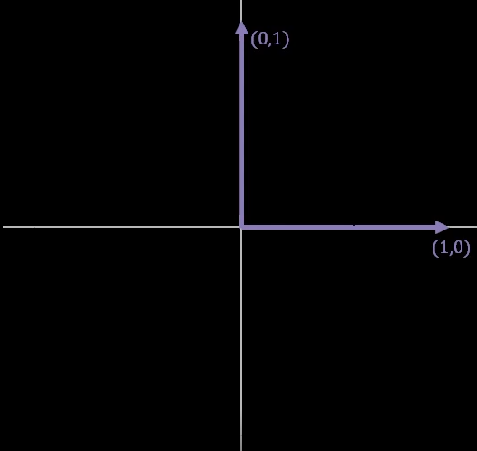
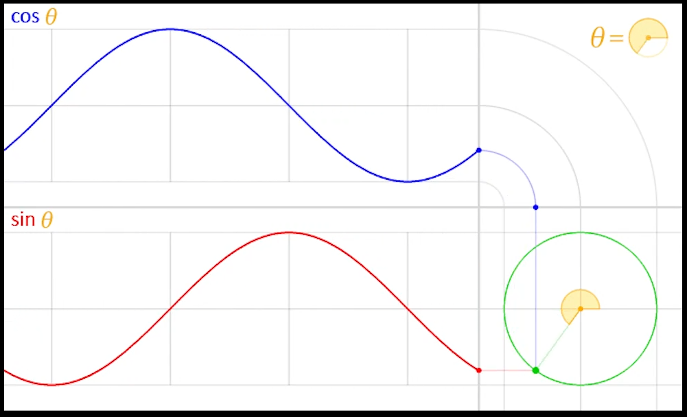

<h1> 회전의 수학 1 : 삼각 함수와 회전 변환 </h1>

<h2> 회전이란? </h2>

트랜스폼(Transform)은 크기, 회전, 이동을 순서대로 진행하는 합성 변환이라고 했다.        
그 중에서도 회전은 별도로 주제를 떼서 설명할 만큼 독특한 변환이다.   

현실세계에서 회전을 한다면, 중심축을 설정하고 물체면 돌리면 된다.   
하지만, 게임에서 변환은 물체가 움직이는 것이 아니고, 물체를 담은 공간이 움직이는 것이다.   
따라서, 가상세계에서 회전을 구현하기 위해서는 물체가 돌아가는 것이 아니라, 공간이 돌아가야 하는 것이다.

그렇다면, 이 무한대로 뻗어있는 벡터 공간을 어떻게 돌려야 할까?

이전에 표준 기저 벡터에 대해 배웠다.   
어떤 벡터공간을 집이라고 한다면, 이를 떠받들고 있는 주춧돌이라고 할 수 있다. 벡터공간의 모든 벡터는 결국 표준 기저 벡터의 선형조합으로 만들어지기 때문이다.    

그렇다면 이 표준 기저벡터를 변경하면 어떻게 될까?   
벡터공간에 속한 모든 원소들이 표준 기저벡터가 변화된 모습에 따라 모두 다시 재배치가 될 것이다.   
이것이 공간 변환의 원리라고 볼 수 있다.   
공간의 변환이란, 원 공간을 떠받들고 있었던 표준 기저 벡터를 변경시켜 새로운 공간을 창조하는 작업이다.

이 원리를 바탕으로 회전을 어떻게 구현하는지 알아보자.

<h2> 회전 변환의 원리 </h2>

회전 변환이 가지고있는 특징 중 하나는, 물체의 모습이 변하지 않는 것이다.   
따라서, 두 표준기저벡터가 변했을 때, 이 표준기저벡터가 가지고 있었던 성질을 똑같이 유지해 주면 회전 변환이 될 수 있다.

2차원 평면을 구성하는 두 표준기저벡터가 가지고 있는 성질을 알아보자.   
아래 그림에서 보는 것 처럼, 각 표준기저벡터의 그기는 항상 1이고, 두 표준기저벡터는 서로 직교하고있다.   
이렇게 두 표준기저벡터가 가지고 있는 성질을 계속 유지해주면 회전변환을 만들 수 있다.

2차원 평면에서 크기가 1인 벡터를 나열하면 어떻게 될까? 아래 그림에서 보이는 것 처럼, 
모이면 동그란 원이 될 것이다.

이렇게 반지름이 1인 원을 단위원이라고 한다.   
이런 단위원상에 위치한 두 벡터를 임의로 뽑으면,
첫번째 조건인 __크기가 1인 벡터를__ 가져올 수 있다.   
이러한 두 개의 벡터중에서, __서로 직각을 이루는__ 어떤 쌍을 발견해서 가져오면, 
이것은 표준 기저벡터가 가지고 있는 성질을
그대로 유지하는 두 개의 새로운 벡터라고 할 수 있다.

이것이 2차원 공간의 회전 변환의 원리라고 할 수 있다. 3차원 4차원 역시 마찬가지일 것이다.

그렇다면 우리는 원호의 점을 어떻게 가져올 수 있을까?
이를 가져오기 위해서는, 삼각함수에 대해 이해해야 한다.

<h2> 삼각 함수(Trigonometric Function) </h2>

원호 위의 한 점을 표현할 때 우리는 직교좌표계 상에서 x,y라는 데이터를 사용해서 표현할 수 있지만,
회전이라는 행동의 관점에서는 기준 위치에서 얼마만큼의 각을 사용해서 회전했는지,
회전한 각과 반지름을 사용해서 표현할 수 있다.

아래 그림에서 수선을 내리면 직각삼각형이 만들어진다.
이 직각삼각형은 빗변, 밑변, 높이의 세 가지 부분으로 이루어져 있다.
이것들을 조합해서 만든 비를 삼각비라고 한다.

대표적인 삼각비로는 
* 높이/빗변
* 밑변/빗변 
* 높이/밑변이 있다.   
여기에서 파생된 것이 삼각함수이다.

삼각형이라는 도형은 모든 각기 90도 이내여야 한다는 제약이 있지만, 이런 비율을 원으로 확장해서 함수로 표현한 것이 삼각 함수이다.
앞서 이야기한 삼각비를 삼각함수에서는 각각 다음과 같이 이야기 한다
* 높이/빗변 = sin(Θ)
* 밑변/빗변 = cos(Θ)
* 높이/밑변 = tan(Θ)

그렇다면, 원 상에 위치한 하나의 벡터를 삼각함수를 통해서 가져올 수 있다고 하였는데, 어떻게 할 수 있을까?

아래 그림을 보자. 우리가 사용하는 단위 원의 반지름이 1일 때, 높이/빗변은 높이, 밑변/빗변은 밑변이 된다.
그렇다면, 원 상에 놓인 한 점의 위치를 표현할 때, (cos(Θ), sin(Θ))라고 할 수 있다.

아래 그림은 삼각함수를 설명할 때 많이 사용하는 그림이다.
X축에 해당하는 것은 밑변인데, 이것은 Cos함수와 관련이 있으며, y축에 해당하는 것은 높이이고 이는 sin함수와 관련이 있다.
그래서 각을 계속해서 늘려나가면, 그림처럼 파형을 만드는 것을 확인할 수 있다.

그렇다면 삼각함수를 사용해서 직교하는 두 기저벡터를 어떻게 얻을 수 있는 것인가?
먼저, 첫번째 표준기저벡터 (1,0)에 대해 살펴보자. 이를 Θ각만큼 늘리면, 이는 (cos(Θ), sin(Θ)의 좌표로 변환이 된다.
그렇다면 첫번재와 직교하는 두번째 표준기저벡터 (0,1)가  각 Θ만큼 회전한 것은 어떻게 될까?
두 삼각형은 합동이기 떄문에, 두번째 표준기저벡터가 회전한 좌표는 (-sin(Θ), cos(Θ))가 된다.

따라서, 회전된 평면 공간이란 결국, 두 벡터 (0,1)과 (1,0)을 (cos(Θ), sin(Θ))와 (-sin(Θ), cos(Θ))로 재구성한 공간이라고 이야기할 수 있는 것이다.
어떤 점, 벡터 공간의 임의의 점 (x,y)를 각 Θ만큼 회전시켰다고 하면, 아래처럼 계산할 수 있다.

위 사진을 보면, 수식이 상당히 복잡하다는 느낌이 들 것이다.
수학자들은 이런 변환을 쉽게 계산하기 위해 새로운 방법을 고안했는데, 이것이 첫번째 영상에서 언급한 행렬이다.

<h2> 행렬(Matrix) </h2>

그렇다면 이런 행렬을 어떻게 설계해야 할까?

지금 이 행렬을 천천히 살펴보면 앞서서 첫 번째 표준기저벡터와 두번째 표준기저벡터가 편화된 값을 하나씩 열로 꽂아준 결과라고 할 수 있다.
이것이 행렬의 설계 원리이다.

우리가 실제로 사용할 3차원 공간에서의 회전 원리는 보다 까다롭다.
3차원 공간에서 임의의 2차원 평면을 설정하고, 그것에 따라서 돌려줘야 하기 떄문이다.
게임에서는 이를 위해서 크게 두 가지 방식을 사용한다.

3차원 공간에서 임의의 회전축을 하나 설정한다. 
그리고 우리가 돌릴 점이 속해있는 평면을 하나 만들고,
그 평면을 따라서 회전시키는 방법이다. 이를 축-각회전이라고 부른다.

다른 방법으로는, x, y, z 세 개의 표준기저벡터를 중심 축으로 잡고, 지정된 순서에 따라
하나씩 총 세번 돌려주는 방법을 사용한다. 이것을 오일러 각 회전이라고 한다.

첫번째 축-각 회전방식의 대표적인 방식으로는 로드리게스 회전공식을 사용한다.
로드리게스 회전공식은, 앞서 언급한 내적과 외적을 사용해 다음 공식을 도출할 수 있다.

오일러 각 회전은 하나의 회전을 일부러 세 번의 회전으로 쪼개서 사용하는 방식이다.
기본 회전축은 우리가 인지하고 있는 표준 기저벡터를 사용하고 있기 떄문에
회전축에 대한 정보는 생략하고, 얼마만큼 돌아갔는지 각에 대한 정보만 저장하는 방식이다.
이 방식은 직관적이기 때문에 대부분의 3차원 그래픽 툴에서 사용하며
적은 양의 데이터로 3차원 회전을 표시할 수 있다.

그런데 이 두 가지 방식 모두 단점이 있다.

__축-각 방식의 단점__   
행렬로 변환하기 어렵기 때문에 렌더링 파이프라인의 중간에 위치한 파이프라인 흐름이 끊기게 된다.
그래서 오히려 역으로 효율이 떨어지는 문제가 발생할 수 있다.

__오일러 각 방식의 단점__
오일러 각 방식은 손쉽게 행렬로 만들 수 있는 반면, 한번의 회전을 세번으로 끊어서 표현하기 떄문에
임의의 축에 대해 부드럽게 회전하는 것을 표현할 때, 매 움직임마다 세번에 끊어서 표현해야 하기 때문에
비효율적이고 까다롭다는 문제가 있다.
또한 한 축의 회전이 증발하는 짐벌락 현상이 발생한다.

그렇다면 3차원 회전을 어떻게 안정적으로 구현할 수 있을까?
수학자와 공학자는 이런 문제를 해결하기 위해 다차원의 수체계를 사용해서 해결했다. 
이가 바로 사원수(Quaternion)이다.
