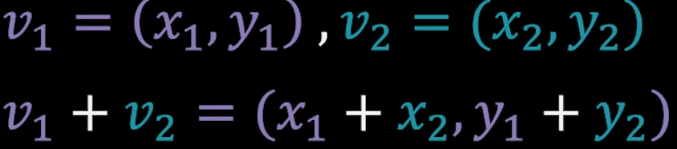

<h1> 물체의 수학 3 : 벡터의 내적과 외적 </h1>

<h2> 들어가기 전에 </h2>
<h3> 게임 콘텐츠가 어떻게 만들어질까? </h3>
1. 로컬 공간 : 개별 물체의 공간
    -> 게임을 만들기 위해서는 게임에서 사용되는 각 물체를 기획한다. 그리고 개별 물체를 표현하기 위해서 로컬 공간을 설정하고, 로컬 공간 안에서 물체 모델링을 진행한다. 맥스, 마야, 블렌더 등을 사용한다. 그 결과물을 메시라는 데이터로 변환하여 게임 엔진에 들어간다. 이런 모델링 데이터가 게임 엔진으로 들어오면, 모든 면은 삼각형 단위로 쪼개지고 각 삼각형은 세 개의 정점으로 구성된다. 
2. 월드 공간 : 물체들이 모인 게임의 공간
    -> 게임 제작자들은 이를 사용해서 게임 세상을 구축하게 된다. 흔히 게임 스테이지라고 부르는 월드 공간이 이런 물체를 모두 모아서 구성한 공간이라고 할 수 있다.
3. 카메라 공간 : 플레이어가 보는 공간
    -> 스테이지 구성이 완료되면, 보통은 플레이어를 월드에 배치하고, 캐릭터에 배치된 카메라를 사용해서 탐험하는 형태로 게임 컨텐츠가 만들어진다. 이 때, 카메라의 보여지는 영역에 속해있는 물체만 걸러내는 작업을 한다. 프러스텀 컬링(Frustum Culling).
4. 최종 렌더링 진행
    -> 이렇게 카메라 영역에 나온 물체를 걸러주고, 그 물체의 메시 데이터를 분석해서 그래픽 카드에 넘겨주면, 순서대로 그려서 최종 화면을 완성하게 된다.

* 로컬 공간 - 월드 공간의 변환   
    * 게임이 시작되면, 프레임마다 월드 공간이 사용자 입력과 지정된 로직에 따라 시뮬레이션 되고, 이 프레임에 수행할 시뮬레이션이 완성되면, 카메라에 보여지는 물체만 걸러내서 렌더링을 실행하게 된다.   
        * 전자를 게임 로직(벡터의 수학) : 물체의 배치 설정. 특수한 경우를 제외하고는 점에 대한 수학을 쓸 일이 별로 없다. 게임에서 물체가 이도하는 것은 물체를 구성하는 점이 이동하는 것이 아니라, 물체를 담는 공간이 이동하는 것. 따라서 이때는 점을 다루지 않고, 평행 이동한 공간의 원점과, 그 공간을 구성하는 중심축의 변환에 대해서만 신경쓰면 된다. 
          * 이렇게 공간의 변환을 설정하는 것을 트랜스폼(Transform)이라고 한다. 트랜스폼의 최종 정보는 내부적으로는 행렬로 구성되어 있지만, 게임 로직에서는 행렬의 정보를 사용하지 않고, 크기, 위치, 회전의 세 가지 데이터로 쪼개서 관리한다. 즉, 게임 로직에서는 크기, 위치, 회전에 대한 정보만 관리하면, 이 다음에 진행하는 렌더링 로직에서는 이를 기반으로 행렬을 구성하고, 이것을 사용해서 고속으로 우리가 필요한 변환을 한번에 진행한다. 벡터에 대한 수학이란 개별 물체가 가지고 있는 크기, 위치, 회전에 대한 정보를 계산하는데 사용하는 수학이다. 대부분의 게임 엔진을 사용해 게임을 제작하는 작업들은 이 세 가지 종류의 데이터를 정하는 작업이 대부분이기 때문에, 실질적인 게임 개발에 있어서는 벡터에 대한 수학을 사용한다고 할 수 있다.
          * 보통 게임에서 벡터를 사용한다고 하면, 기본 물리 공식을 사용해서 점프라던지, 물체가 포물선을 그려서 날아가는 작업을 생각할 수 있는데, 사실 그 전에, 벡터를 잘 다루기 위해서는 벡터가 가지고 있는 연산이 어떤 것인지 알아보고, 그 연산들이 가지고 있는 기본 원리에 대해 잘 파악해야 한다.
          * 벡터의 연산을 통해 벡터와 스칼라가 상호 순환하는 시스템이 만들어진다.
        * 후자를 렌더링 로직(공간의 수학과 점의 수학) : 화면에 그릴 데이터 설정 이라고 한다.

<h3> 벡터의 연산 </h3>
1. 벡터와 벡터의 덧셈(기본)
2. 벡터와 스칼라의 곱셈(기본)
3. 벡터의 내적(응용)
4. 벡터의 외적(응용)

__스칼라(Scalar) : 사칙 연산이 가능한 수 집합의 원소__

<h3> 기본 연산 </h3>
1. 벡터와 벡터의 덧셈(기본)   
벡터의 덧셈은 굉장히 간단하다. 다음 그림에서 보이는 것 처럼, 각 축의 크기만큼 평행 이동한다.

2. 벡터와 스칼라의 곱셈(기본)   
다음 그림에서 보이는 것 처럼, 벡터와 스칼라의 곱셈은 벡터가 가지는 고유한 성질(평면의 기울기)를 그대로 유지한 상태에서, 원점에서의 크기를 조절해주는 동작이라고 할 수 있다.

이 두 연산을 벡터의 기본 연산이라고 하는데, 두 개의 연산을 조합하면 새로운 벡터를 생성해 낼 수 있다.   
이것을 선형 조합(Linear Combination)이라고 한다.

평행하지 않은 두 벡터를 조합하면, 평면에 있는 모든 벡터를 생성할 수 있다.   
벡터의 두 기본 연산은 벡터의 생성 시스템에 사용하는 선형 조합을 구성하는 필수 연산이다.

선형 조합을 하는데 가장 기본이 되는 벡터 두 개를 꼽는다면, x축의 (1, 0)과 y축의 (0, 1)이라고 할 수 있다.   
이 둘을 조합하면 공간에 속한 모든 벡터를 손쉽게 생성할 수 있다.   
따라서 이 두 개를 표준 기저 벡터(Standard Basis Vector)라고 한다.

두 가지의 연산만으로는 응용하여 뭔가를 표현하기에는 부족하다. 따라서 벡터의 외적과 내적을 사용한다.   
벡터의 내적과 외적은 게임 로직에서부터 셰이더에 이르기 까지 게임 제작 과정에서 벡터를 응용하는데 사용하는 유용한 연산들이다.   

3. 벡터의 내적(응용)   
벡터의 내적은 벡터의 응용에 관련된 거의 모든 공식에 사용된다고 보면 된다.   
벡터 내적의 공식은 다음과 같다.

각 축의 요소를 각각 곱한 후, 더하면 된다.   

이러한 내적 공식은 컴퓨터가 굉장히 빨리 계산할 수 있으며, 많은 곳에서 활용할 수 있다.   
내적을 사용하면, 두 벡터가 서로 직교하고 있는지, 아니면 물체가 나의 앞에 있는지 뒤에 있는지 판별하는데 사용할 수 있고,   
어떤 시야각이 주어졌을 때, 해당 시야각 영역에 물체가 안에 있는지 밖에 있는지를 판별할 수 있다.   
내적의 또 다른 중요한 용도는, 어떤 벡터를 다른 벡터에 투영시킬 때 사용된다.   
이 내적의 투영 공식에서부터 평면의 방정식이 유도되고, 이 평면들이 모여서 절두체 영역을 만든다.   
절두체는 카메라가 보여지는 영역을 의미하는 것이고, 여기에서 카메라가 보는 영역 안에 있는 물체만 골라낼 수 있는 수학 공식과 알고리즘이 만들어진다.   

5. 벡터의 외적(응용)
벡터의 내적 연산은 어떤 차원에서든지 계산이 가능하지만, 벡터의 외적 연산은 3차원에서만 가능하다.   
두 벡터의 외적의 공식은 다음과 같다.

벡터의 외적은 서로 다른 요소만 조합해서 사용하는 특징이 있다.

내적이 직교성을 판별하는데 사용했따면, 외적은 평행성을 판별하는데 사용한다.
또한 내적은 앞뒤를 판별하는데 사용되면, 외적은 좌우를 판별하는데 사용된다.
이렇듯, 외적은 내적의 부족한 부분을 보충해주는 성질이 있어서, 이 둘을 조합해서 다양한 문제를 해결할 수 있다.   

이런 외적 연산이 많이 사용되는 응용 방법에는, 두개의 벡터가 만들어내는 평면에 수직인 벡터를 만들어내는 것이다.   
평행하지 않은 두 벡터의 조합은 평면을 만들어낸다. 여기에 수직인 벡터, 즉 평면의 방향을 외적을 통해 파악할 수 있다.   
이러한 과정을 계속 거치면, 3차원 공간을 구성하는 세가지 축을 모두 외적을 사용해서 계산할 수 있다.   
**이 문제는 게임회사 입사 시험에 단골로 나오는 문제이기 때문에, 게임 회사 면접이나 입사시험을 준비하면 꼭 알아두는 것을 권장한다**

<h2> 정리 </h2>
벡터에는 두 가지 기본 연산과, 두 가지 응용 연산이 있다.   
응용 연산인 벡터의 내적과 외적은 상호 보완적인 성질을 가지고 있다.   
따라서 물리엔진을 사용해서 문제를 해결하기 보다는, 내적과 외적이 가지는 수학적 성질을 사용해서 1차적으로 해결하는 것을 권장한다.